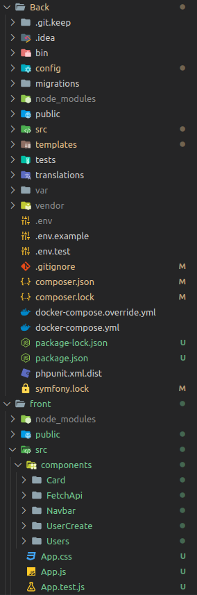

<h1 align="center" id="title">Job Board</h1>


<h2>🛠️ Installation Steps:</h2>

</br>

<p>1. Clone repo from github :</p>
</br>

```
Repo/git
```

<p>2. Install Dependencies:</p>

```
cd Back && symfony-cli-lts 
```

```
cd Back && composer install && update 
```

```
cd front && npm install
```

<p>3. Start Mysql :</p>

```
source [path to file]/Jobb.sql;
```

```
use Jobb;
```

<p>4. Start the project :</p>

```
cd Back && symfony serve
```

```
cd front && npm start
```

<h2>🍰 Working tree:</h2>
</br>

  
  
</br>
  
<h2>💻 Built with</h2>
</br>

Technologies used in the project:
</br>
</br>

<a href="#"></a>
<a href="#"></a>
<a href="#"></a>
</br>
</br>


This project is licensed under the EPITECH Corporation

<h2>Like our work?</h2>

For support Please Contact..

<a href="#"></a>